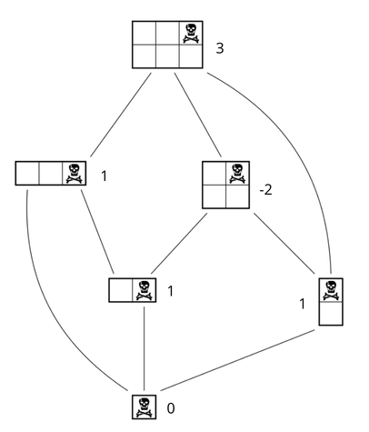
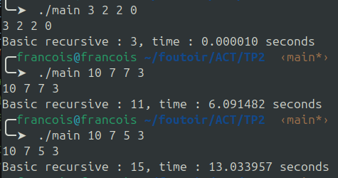

# ACT

## TP2: Programmation dynamique: le jeu du chocolat

### GIBIER François | MAZURE Antoine

### Q1)

Configuration = (m, n, i, j)
Avec :
m la largeur de la tablette
n la hauteur de la tablette
i l'abscisse du carré de la mort
j l'ordonnée du carré de la mort

### Q2)

### Q3)

On itère sur toutes les coupes possibles c'est à dire de (1 à x-1) + (1 à y - 1) avec x la largeur et y la hauteur de la tablette, dépendant du sens de coupe du joueur.

Et donc, pour tout k allant de 1 à (x - 1) ou (y - 1), la nouvelle tablette sera soit (m, n - k) ou (m - k, n), le carré de la mort serait (i - k, j) ou (i, j - k).

On aurait x + y - 2 configurations différentes.

### Q4)

On prend le 1 - max(successeurs) dans le cas où tous les successeurs sont positifs, sinon on prend 1 - max(successeurs) parmi les successeurs négatifs.

$MAX(successors) =
     \begin{cases}
       0 & \text{si x = 0} \\
       1 - \max(negsuccessors) & \exists x \in successors, x < 0; negsuccessors \subset successors \cap Z^− \\
       - (1 + \max(successors)) & \text{sinon}
     \end{cases}
$

### Q5)

Voir algorithme **calculate_configuration** dans _tablet.c_.

### Q6)

### Q7)

Plus le carré de la mort est au centre de la tablette, plus la réduction de la tablette sera lente. Les sous-tablettes seront plus grandes. Si le carré de la mort est disposé loin du centre, la réduction de la tablette à chaque découpe sera plus grande,
on aura beaucoup moins d'appels récursifs.

On a à chaque fois m + n - 2 appels récursifs à chaque tour, soit (m + n - 2) * ((m - 1) + (n - 1) - 2) * ((m - 2) + (n - 2) - 2), jusqu'à arriver à une tablette de taille (1, 1).

La profondeur de l'arbre de récursion est au plus m + n (car chaque coupe réduit soit m soit n de 1).
Cela donne un arbre de décision dont le nombre de noeuds est de l'ordre de $O(2^{m+n})$. La complexité de l'algorithme est donc bien exponentielle.

### Q8)

On peut utiliser un tableau de taille $m * n * i * j$ avec m la largeur de la tablette, n sa longueur, i l'abscisse du carré de la mort et j son ordonnée, comme ça si une configuration (x, y) (k, l) a déjà été calculée, pas besoin de la recalculer, on récupère sa valeur dans le tableau à l'indice [x][y][k][l].

Voir algorithme **calculate_configuration_dynamic** dans _tablet.c_.

### Q9)

(100, 100, 50, 50) : -198

(100, 100, 48, 52) : 191

### Q10)

Les configurations permettant d'obtenir 127 avec une tablette de taille (127, 127) sont :

- (63, 126)
- (126, 63)
- (63, 0)
- (0, 63)

On remarque qu'on obtient les configurations qui se trouvent au milieu des côtés de la tablette.

Voir algorithme **find_pairs_with_value_x** dans _experiments.c_.

### Q11)

On initialise un seul tableau de taille (m, n, m / 2 + 1, n / 2 + 1) avec m = 127 et n = 127 ici et on l'utilise pour calculer toutes les configurations possibles de 0 à m / 2 + 1 et de 0 à n / 2 + 1, on est pas obligé de parcourir de 0 à m et 0 à n car on peut jouer sur les symétries pour diviser par 4 les calculs.

On a donc une complexité en espace en $θ(m * n * (m / 2 + 1) * (n / 2 + 1))$ soit $O(m^2 * n^2)$

### Q12)

Toutes ces configurations sont symétriques, soit par rotation, soit par symétrie axiale horizontale, verticale ou diagonale.

Par exemple, une tablette $m * n$ avec un point (i, j) tourne en $n * m$, avec les coordonnées du point modifiées, mais le nombre de configurations enfants ne change pas.

Les symétries axiales ne changent pas les configurations possibles. La tablette est symétriquement équivalente. Par exemple, pour une symétrie par rapport à une diagonale, le point (i, j) devient (m − 1 − i, n - 1 - j), mais le problème reste le même.

### Q13)

Voir algorithme **calculate_configuration_dynamic_symetric** dans _tablet.c_.

### Q14)

On peut exploiter les symétries pour réduire la taille du tableau.

On peut supprimer les symétries par rotation en initialisant les deux premières dimensions du tableau par (MIN(m, n), MAX(m, n)).

On peut ensuite supprimer les symétries axiales en jouant sur les deux dernière dimensions (i et j).
Déjà, on prend de i'= MIN(i, m - 1 - i) et j' = MIN(j, n - 1 - j) ce qui permet d'éliminer les symétries horizontales et verticales.

On peut ensuite éliminer la symétrie en diagonale en prenant toujours comme troisième et quatrième dimension du tableau (MIN(i', j'), MAX(i', j')).

On passe donc d'un tableau de $m * n * i * j$ à un tableau de $(\min{m, n}) * (\max{m, n}) * i'' * j''$

Avec :

- $i' = MIN(i, m - 1 - i)$
- $j' = MIN(j, n - 1 - j)$
- $i'' = MIN(i', j')$
- $j'' = MAX(i', j')$

L'espace gagné ne dépend donc que de i et j, plus i et j vont se rapprocher de $m / 2$ et $n / 2$, moins on gagnera d'espace.
Pour i = m / 2 et j = n / 2 avec n et m impairs, on ne gagne pas d'espace car il n'y a pas de symétries.
Le meilleur des cas (celui où les symétries permettent de gagner le plus de mémoire) est donc celui où i et j sont à la même distance de m pour i et n pour j. Par exemple pour une tablette de (100, 100), la configuration où on gagne le plus de mémoire sera (25, 75), car on passe de $100 * 100 * 25 * 75 = 18750000$ à $100 * 100 * 25 * 25 = 6250000$, on divise l'espace mémoire par $(\max{i, j}) / (\min{i, j})$. (Dans le cas réel, il faut multiplier la mémoire utilisée par deux car on utilise des entiers de deux octets).

On a une complexité en $0(m * n * i'' * j'')$

On peut aussi utiliser une table de hachage, qui permettrait de gagner en mémoire en échange de temps de calculs.

Voir algorithme **calculate_configuration_hashmap** dans _tablet.c_.

Voici quelques graphiques pour comparer les différents algorithmes en temps et en espace.

La mémoire est multipliée par deux car on utilise des entiers de deux octets dans le tableau (int16_t).

### Q15)

Voir algorithme **game** dans _tablet.c_.

### Q16)

Le jeu de la tablette est similaire au jeu de Nim car, dans les deux cas, les joueurs alternent pour effectuer des coups qui modifient la configuration de jeu, le but étant de forcer son adversaire à se retrouver dans une position perdante. De plus, les configurations peuvent être analysées et on peut leur attribuer une valeur gagnante ou perdante.