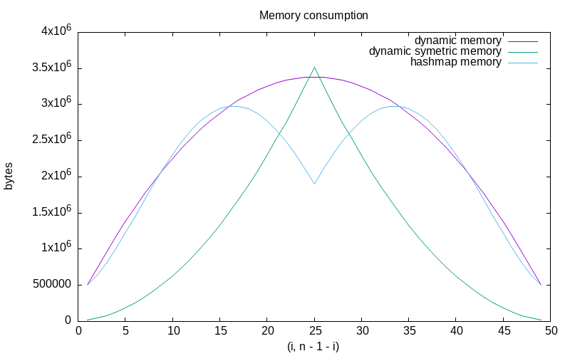

# ACT

## TP2: Programmation dynamique: le jeu du chocolat

### GIBIER François | MAZURE Antoine

### Q1)

Configuration = (m, n, i, j)
Avec :
m la largeur de la tablette
n la hauteur de la tablette
i l'abscisse du carré de la mort
j l'ordonnée du carré de la mort

### Q2)

```
    -3
+1  +2  +1
  -1
     0
```

### Q3)

On itère sur toutes les coupes possibles c'est à dire de (1 à x-1) + (1 à y - 1) avec x la largeur et y la hauteur de la tablette, dépendant du sens de coupe du joueur.

Et donc, pour tout k allant de 1 à (x - 1) ou (y - 1), la nouvelle tablette sera soit (m, n - k) ou (m - k, n), le carré de la mort serait (i - k, j) ou (i, j - k).

On aurait x + y configurations différentes.

### Q4)

On prend le 1 - max(successeurs) dans le cas où tous les successeurs sont positifs, sinon on prend 1 - max(successeurs) parmi les successeurs négatifs.

$P(successors) =
     \begin{cases}
       0 & \text{si x = 0} \\
       1 - \max(negsuccessors) & \exists x \in successors, x < 0; negsuccessors \in successors \cap Z^− \\
       - (1 + \max(successors)) & \text{sinon}
     \end{cases}
$

### Q5)

voir fonction **calculate_max** dans _tablet.c_.

### Q6)

### Q7)

Avec la version récursive simple (sans tableau), on a :

(10, 7) (7, 3) : 5.760348 secondes

(10, 7) (5, 3) : 12.730570 secondes

### Q8)

On peut utiliser un tableau de taille $m * n * i * j$ avec m la largeur de la tablette, n sa longueur, i l'abscisse du carré de la mort et j son ordonnée, comme ça si une configuration (x, y) (k, l) a déjà été calculée, pas besoin de la recalculer, on récupère sa valeur dans le tableau à l'indice [x][y][k][l].

### Q9)

(100, 100, 50, 50) : -198

(100, 100, 48, 52) : 191

### Q10)

Les configurations permettant d'obtenir 127 avec une tablette de taille (127, 127) sont :

- (63, 126)
- (126, 63)
- (63, 0)
- (0, 63)

On remarque qu'on obtient les configurations qui se trouvent sur le milieu des côtés de la tablette.

### Q11)

On initialise un seul tableau de taille (127, 127), (127, 127) et on l'utilise pour calculer toutes les configurations de (127, 127) (0, 0) à (127, 127) (126, 126).

On a donc une complexité en espace en $O(m^2 * n^2)$

### Q12)

Toutes ces configurations sont symétriques, soit par rotation, soit par symétrie axiale horizontale, verticale ou diagonale.

Par exemple, une tablette $m * n$ avec un point (i, j) tourne en $n * m$, avec les coordonnées du point modifiées, mais le nombre de configurations enfants ne change pas.

Les symétries axiales ne changent pas les configurations possibles. La tablette est symétriquement équivalente. Par exemple, pour une symétrie par rapport à une diagonale, le point (i, j) devient (m − 1 − i, n - 1 - j), mais le problème reste le même.

### Q14)

On peut exploiter les symétries pour réduire la taille du tableau.

On peut supprimer les symétries par rotation en initialisant les deux premières dimensions du tableau par (MIN(m, n), MAX(m, n)).

On peut ensuite supprimer les symétries axiales en jouant sur les deux dernière dimensions (i et j).
Déjà, on prend de i'= MIN(i, m - 1 - i) et j' = MIN(j, n - 1 - j) ce qui permet d'éliminer les symétries horizontales et verticales.

On peut ensuite éliminer la symétrie en diagonale en prenant toujours comme troisième et quatrième dimension du tableau (MIN(i', j'), MAX(i', j')).

On passe donc d'un tableau de $m * n * i * j$ à un tableau de $(\min{m, n}) * (\max{m, n}) * i'' * j''$

Avec :

- $i' = MIN(i, m - 1 - i)$
- $j' = MIN(j, n - 1 - j)$
- $i'' = MIN(i', j')$
- $j'' = MAX(i', j')$

L'espace gagné ne dépend donc que de i et j, plus i et j vont se rapprocher de $m / 2$ et $n / 2$, moins on gagnera d'espace.
Pour i = m / 2 et j = n / 2 avec n et m impairs, on ne gagne pas d'espace car il n'y a pas de symétries.
Le meilleur des cas (celui où les symétries permettent de gagner le plus de mémoire) est donc celui où i et j sont à la même distance de m pour i et n pour j. Par exemple pour une tablette de (100, 100), la configuration où on gagne le plus de mémoire sera (25, 75), car on passe de $100 * 100 * 25 * 75 = 18750000$ à $100 * 100 * 25 * 25 = 6250000$, on divise l'espace mémoire par le quotient du maximum de i et j par le minimum de i et j ($(\max{i, j}) / (\min{i, j})$).

On a une complexité en $0(m * n * i'' * j'')$

D'après les expérimentations (voir _experiments.c_), on a une accélération du programme d'environ 230% et on utilise environ 50% de mémoire en moins en utilisant les symétries.



La mémoire est multipliée par deux car on utilise des entiers de deux octets dans le tableau (int16_t).


