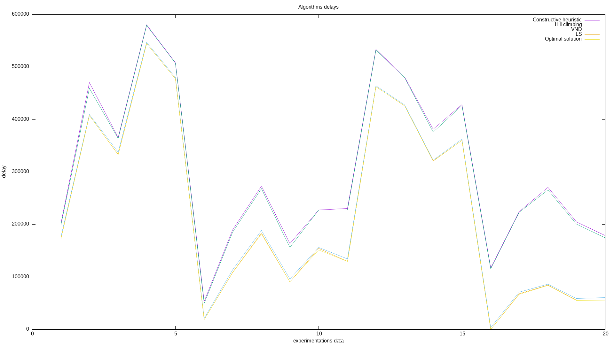

# ACT 
## TP4: Heuristiques — problème d’ordonnancement

### GIBIER François  |  MAZURE Antoine

### Heuristiques constructives et recherche locale simple

Q1.0) Voir algorithme *file_experiment* dans [experiment.c](./src/experiments.c).

Q1.1) Voir algorithme *sum_delay_value* dans [process.c](./src/process.c).

Q1.2) Voir algorithme *generate_random_solution* dans [process.c](./src/process.c).

Q1.3) Pour implémenter une heuristique constructive, il faut définir une stratégie de sélection du meilleur processus à chaque fois, jusqu'à obtenir un ordonnancement complet.
On peut prendre comme critère de sélection le processus qui va minimiser le retard. Cette heuristique est plutot performante et permet d'avoir une solution qui est dans la moyenne par rapport aux autres critères de sélection, elle permet d'avoir un ordonnancement correct dans la plupart des cas, mais ne permet pas d'obtenir une solution proche de l'optimal.
Contrairement, d'autres critères de selection comme l'ordonnancement selon le temps limite d'une tache permettent de se rapprocher de la solution optimale quand elle est enclavée et difficile à atteindre (cf: Fichiers 6 et 16).

[Heuristique constructive](./src/process.c) (ligne 36)
Les autres heuristiques ont été implémentées avec un tri rapide. [quicksort](./src/quicksort.c), [fonctions de swapping](./src/swap_functions.c)


Q1.4) Pour rechercher localement une solution acceptable, il faut utiliser un voisinage peu éloigné pour converger vers une solution "optimale", mais il ne faut pas qu'il soit trop proche non plus pour pouvoir sortir des optimum locaux.
On peut notamment choisir d'inverser un élément à chaque fois, par exemple inverser le premier et le deuxième processus, ensuite le deuxième et troisième...
On peut aussi générer les permutations de processus à 1 de distance (faire toutes les inversions de processus), mais cette méthode est très coûteuse et génère n² - n voisins au lieu de n - 1 pour les autres voisinages.

On remarque que cherche dans des voisinages trop éloignés peut empêcher de converger vers une meilleure solution que des voisinages proches. Par exemple, le swap symétrique (inverse le processus i et le processus nb_processus - 1 - i) est moins performant que seulement inverser les processus aux indices i et i + 1.


Pour ce qui est du VND (Variable Neighborhood Search), il peut être intéressant de rechercher dans des voisinages proches et d'ensuite tester des voisinages plus éloignés, pour pouvoir converger vers un optimum local mais pouvoir en sortir si un meilleur ordonnancement est trouvé.

On peut prendre le swap de deux processus voisins dans l'ordonnancement pour améliorer un optimum local, puis augmenter la perturbation en inversant avec des processus au milieu, puis on peut échanger des sous-ensembles entiers dans l'ordonnancement pour aller chercher des voisinages plus éloignés.

Voici l'ordre des fonctions de voisinages utilisées pour VND:
```
swap_function swap_functions[] = {
    swap_i_and_i_plus_1,
    swap_i_and_middle,
    swap_symetric,
    swap_random_nb_processes_per_4,
    swap_random,
    swap_i_and_i_plus_1_three_times
};
```

Q1.5) Pour l'ILS (Iterated local search), on va utiliser l'algorithme VND (performant et rapide) et essayer d'améliorer sa solution en la perturbant et en l'acceptant, ou non.
On peut utiliser les algorithmes de swapping changeant grandement un ordonnancement pour perturber la meilleure solution courante et espérer trouver une solution dans un voisinage distant. On applique ensuite l'algorithme VND pour trouver le minimum local de la solution courante.
On peut donc prendre l'inversion symétrique, qui va modérément impacter la solution, ce qui permet d'aller explorer d'autres parties de l'espace des solutions.
On peut aussi perturber la solution courante en inverse plusieurs des processus, ici on en inverse 3 qui est un bon compromis entre une grande perturbation et une recherche locale.

On peut prendre comme fonction d'acceptation un algorithme qui accepte une solution quand on a fait n itérations de perturbation et de recherche locale. Par exemple 5000 itérations. On atteint un pic au delà de quelques miliers d'itérations où la solution n'est plus améliorée car la perturbation reste la même.
On peut aussi prendre le temps d'utilisation du CPU, par exemple arrêter de rechercher quand on a dépassé 10 secondes.
On pourrait aussi utiliser une fonction qui accepte si le meilleur ordonnancement trouvé s'il n'a pas changé depuis n itérations, pour ne pas faire d'itérations dans le vide.

1.6) La méthode d'inversion de l'ordonnancement à une distance de 3 permet de trouver plus fréquemment l'ordonnancement optimal et est plus performante que les autres inversions, par exemple, celle inversant 5 processus et non 3 perturbe trop l'ordonnancement courant et ne permet pas d'aller chercher l'optimum global.
Cependant, l'inversion symétrique est quelquefois plus performante quand on ne trouve pas la solution optimale, elle permet de s'en approcher plus.

Utiliser le temps CPU au lieu d'un nombre d'itérations permet de mieux controler l'éxécution du programme, l'autre dépendant plus des ressources de la machine.


1.7) Les expérimentations ont été faites dans le fichier [experiments.c](./src/experiments.c), on teste les différentes méthodes d'inversion sur le hill climbing, ainsi que les différentes heuristiques constructives.

Voici les différents ratio trouvés:

```
Constructive: 22.421984
limit_time_value: 2.769039
weight times 1 over limit: 22.340798
sum delay: 51.520843
weight over time: 30.235865

Hill climbing: 22.071335
VND: 1.659784
ILS: 1.004429
```

Cependant, un des exemples donnés (100_85) possède une solution optimale "enclavée", ce qui fausse les résultats globaux sur le hill climbing, voici donc les ratio sans cet exemple:

```
Constructive: 22.421984
limit_time_value: 2.769039
weight times 1 over limit: 22.340798
sum delay: 51.520843
weight over time: 30.235865

Hill climbing: 1.800627
VND: 1.043375
ILS: 1.002322
```

L'ILS avec la perturbation inversant 3 processus et itérant 5000 fois est donc la plus performante, là où les différentes heuristiques constructives ne permettent pas de trouver des solutions convenables. Il faut itérer sur l'ordonnancement courant pour essayer de minimiser encore.
On a donc en moyenne un ordonnancement provoquant 0.4% de délai en plus que l'ordonnancement optimal pour l'ILS.

Graphique du délai des différents algorithmes:



### Commandes

Pour compiler le TP:
```
make
```

Pour exécuter le TP:
```
./main
```

Pour compiler les expérimentations:
```
make experiments
```

Pour exécuter les expérimentations:
```
./experiments_main
```